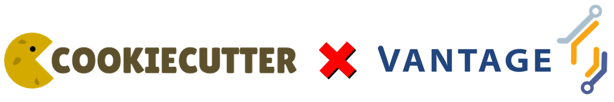

# Cookiecutter for Python Algorithm Development for vantage6

*A lean [Cookiecutter template](https://github.com/cookiecutter/cookiecutter) for developing algorithms for [vantage6](https://github.com/vantage6/) in Python.*

<h1 align="center">
  <a href="https://vantage6.ai"></a>
</h1>

## Requirements:
* Python >=3.7
* [Cookiecutter Python package](http://cookiecutter.readthedocs.org/en/latest/installation.html) >= 2.0.0

 Depending on how you manage your Python packages, Cookiecutter can be installed with [`pip`](https://pypi.org/project/pip/):

``` bash
$ pip install cookiecutter
```

or with [`conda`](https://docs.conda.io/en/latest/) (as shown in [`conda-forge`](https://anaconda.org/conda-forge/cookiecutter)):

``` bash
$ conda install -c conda-forge cookiecutter
```

## Creating a new algorithm (template)

To create a new algorithm template, run:

    cookiecutter https://github.com/vantage6/cc_algorithm_python

For the sake of brevity, GitHub repositories can just use the `gh` prefix:

    cookiecutter gh:vantage6/cc_algorithm_python

Afterwards, you will be prompted to enter a few values. After inputting each
of them, make sure to type `enter`:

| Field | Description |
|---|---|
| `project_name` | Name of the project |
| `repo_name`  | Name of the (GitHub) repository. Spaces will be replaced by underscores (`_`). Please use [`snake_case`](https://en.wikipedia.org/wiki/Snake_case) and *avoid* dashes (`-`)! |
| `author_name`  | Your name (or your organization, company, or team) |
| `description` | A short description of the algorithm. Please include the core details of your algorithm (e.g., if it for [horizontally- or vertically-partitioned data](https://vantage6.ai/documents/7/moncada-torres2020vantage6_57GU4Gt.pdf), if it is an [MPC](https://en.wikipedia.org/wiki/Secure_multi-party_computation) algorithm, etc. |
| `open_source_license` | The software license for your project (more information below). |

## Licenses
Currently, you can choose from three different licenses when creating your
algorithm template:

* [MIT](https://choosealicense.com/licenses/mit/)
* [Apache License 2.0](https://choosealicense.com/licenses/apache-2.0/)
* [BSD-3-Clause](https://opensource.org/licenses/BSD-3-Clause)
* (No license)

#### Adding more licenses *to the template*
If you are interested in adding more licenses *to the template*:

* See [`choosealicense.com`](https://choosealicense.com/licenses/) (or any other
  resource) and choose the license that is appropriate for your use case.
* Go to `cookiecutter.json` and add the license name to the `open_source_license` list.
* Go to `setup.py` and add the license to the `license` string in `setup`.
* Go to `{{ cookiecutter.repo_name }}/LICENSE` and copy-paste the license text in its
corresponding `if`.
* In the license text, change the important fields to [Jinja delimiters](https://jinja.palletsprojects.com/en/3.1.x/templates/) (e.g., `<year>` to ` {% now 'utc', '%Y' %}`; `<author name>` to `{{ cookiecutter.author_name }}`)


## Contributing

If you wish to contribute, first of all, thank you! Second, please take a look at our [contributing guidelines](https://docs.vantage6.ai/en/main/devops/contribute.html).


## Running tests

    py.test tests
